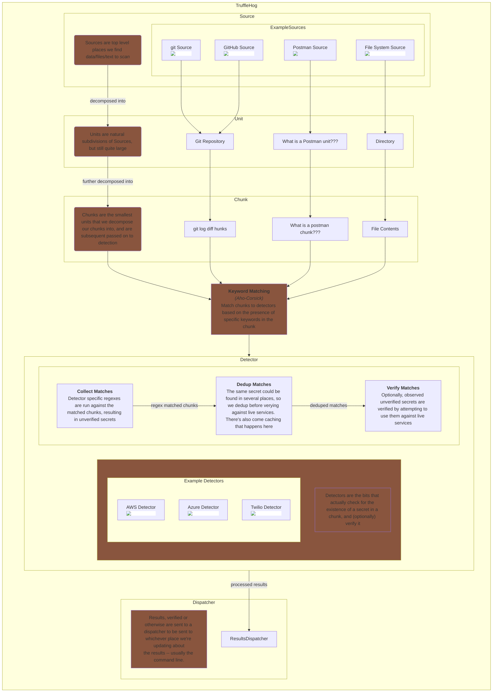

# TruffleHog Structural Overview

```mermaid
flowchart LR
    subgraph TruffleHog

        subgraph Source
            direction TB
            SourceDescription("`Sources are top level places we find data/files/text to _scan_`")
            subgraph ExampleSources
                GitSource["git Source <img src='https://git-scm.com/images/logo@2x.png' style='background-color:white'/>"]
                GitHubSource["GitHub Source <img src='https://forager.trufflesecurity.com/assets/github-fern-4f595c91.svg' style='background-color:white'/>"]
                FilesystemSource["File System Source <img src='https://user-images.githubusercontent.com/664179/39915797-245107d6-5509-11e8-82e4-6421456bf7eb.png' style='background-color:white' />"]
                PostmanSource["Postman Source <img src='https://user-images.githubusercontent.com/49151885/96122371-ad293c00-0ef1-11eb-9e1d-ef148ee03d73.png' />"]
            end
        end

        subgraph Unit
            direction TB
            UnitDescription("`Units are natural subdivisions of Sources, but still quite large`")
            FilesystemUnit[Directory]
            GitUnit[Git Repository]
            PostmanUnit[What is a Postman unit???]
        end

        subgraph Chunk
            direction TB
            ChunkDescription("`Chunks are the smallest units that we decompose our chunks into, and are subsequent passed on to detection`")
            FilesystemChunk[File Contents]
            GitRepositoryChunk["`git log diff hunks`"]
            PostmanChunk[What is a postman chunk???]
        end
        
        KeywordMatching["`**Keyword Matching**
_(Aho-Corsick)_

Match chunks to detectors based on the presence of specific keywords in the chunk`"]

        subgraph Detector
            direction RL
            subgraph DetectorDescription[" "]
                DetectorDescriptionText["`Detectors are the bits that actually check for the existence of a secret in a chunk, and (optionally) verify it`"]
                subgraph Detectors[Example Detectors]
                    direction TB
                    AwsDetector["AWS Detector <img src='https://forager.trufflesecurity.com/assets/aws-mark-b70163d1.svg' style='background-color:white'/>"]
                    AzureDetector["Azure Detector <img src='https://forager.trufflesecurity.com/assets/azure-mark-d5533763.svg' style='background-color:white'/>"]
                    TwilioDetector["Twilio Detector <img src='http://forager.trufflesecurity.com/assets/twilio-mark-df166a11.svg' style='background-color:white'/>"]
                end
            end    
            subgraph DetectorResponsibility[" "]
                direction LR
                
                CollectMatches["`**Collect Matches**

Detector specific regexes are run against the matched chunks, resulting in unverified secrets`"]
                VerifyMatches["`**Verify Matches**

Optionally, observed unverified secrets are verified by attempting to use them against live services`"]
                DedupMatches["`**Dedup Matches**

The same secret could be found in several places, so we dedup before verying against live services. There's also come caching that happens here`"]

                CollectMatches -- regex matched chunks --> DedupMatches
                DedupMatches -- deduped matches --> VerifyMatches
            end
        end

            subgraph Dispatcher
                direction TB
                NotifierDescription["`Results, verified or otherwise are sent to a dispatcher to be sent to whichever place we're updating about
                the results -- usually the command line.`"]
                ResultsDispatcher
            end

        SourceDescription -- decomposed into --> UnitDescription
        UnitDescription -- further decomposed into --> ChunkDescription
        ChunkDescription --> KeywordMatching
        KeywordMatching --> Detector
        Detector -- processed results --> ResultsDispatcher
        
        GitSource --> GitUnit
        GitHubSource --> GitUnit
        PostmanSource --> PostmanUnit
        FilesystemSource --> FilesystemUnit
        
        GitUnit --> GitRepositoryChunk
        PostmanUnit --> PostmanChunk
        FilesystemUnit --> FilesystemChunk
        
        GitRepositoryChunk --> KeywordMatching
        PostmanChunk --> KeywordMatching
        FilesystemChunk --> KeywordMatching
        
        style SourceDescription fill:#89553e
        style UnitDescription fill:#89553e
        style ChunkDescription fill:#89553e
        style KeywordMatching fill:#89553e
        style DetectorDescription fill:#89553e
        style DetectorDescriptionText fill:#89553e
        style NotifierDescription fill:#89553e
    end
```
